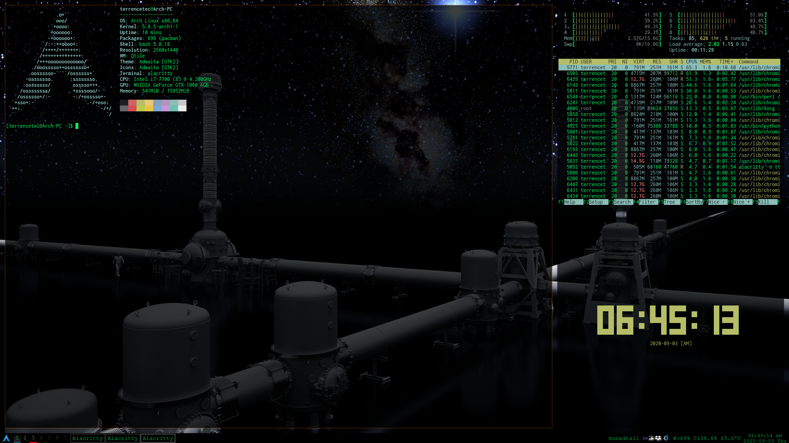

|logo|

**My Arch Linux PC at my home, hopefully inheritable.**

|distro| |kernal| |dm| |greeter| |theme| |wm| |terminal| |input|

.. contents::
   :depth: 3

Arch Linux
=====================
|archweb2| |archweb3| |archweb4| |archweb5|

This is a backup of my Arch Linux system and configuration files installed on
my PC (Samsung SSD EVO 850 250GB). Here's some documentation about the PC so I
don't forget about the setup.

Installation
------------
The ArchWiki `installation guide
<https://wiki.archlinux.org/index.php/Installation_guide>`__
provides a very nice straightforward step-by-step guide on how to install Arch
Linux on my machine. I also watched DistroTube's
`Arch Linux Installation Guide (2019)
<https://www.youtube.com/watch?v=HpskN_jKyhc>`__ for reference.

**Note**

I broke my Ubuntu using cfdisk to shrink my drive for my first Arch. After
installation of Arch, Ubuntu presented me with an emergency mode screen. I
didn't bother to fix it so wiped the whole drive afterwards just so that I can
have a clean installation of Arch. So I need to be careful on installing
multiple OSes on same drive.

Post-installation
-----------------
Be sure to check out `General recommendation
<https://wiki.archlinux.org/index.php/General_recommendations>`__ first.
Somethings so do after installation besides the `General recommendation
<https://wiki.archlinux.org/index.php/General_recommendations>`__ in ArchWiki

Sync

Install git
^^^^^^^^^^^
:code:`sudo pacman -S git`

Clone my dotfiles and config files
^^^^^^^^^^^^^^^^^^^^^^^^^^^^^^^^^^
:code:`git clone https://www.github.com/terrencetec/linux-configs.git`
And use them when accordingly. If necessary, Fork this and make another
sub-repository.

Install base-devel
^^^^^^^^^^^^^^^^^^
:code:`sudo pacman -S base-devel`

Install yay
^^^^^^^^^^^
.. code:: Bash

  git clone https://aur.archlinux.org/yay.git
  cd yay
  makepkg -si

Install terminal emulator
^^^^^^^^^^^^^^^^^^^^^^^^^
Pick whichever I am currently using.
I have been using gnome-terminal.

Install display stuff
^^^^^^^^^^^^^^^^^^^^^
- Xorg
- python
- `Qtile <http://www.qtile.org/>`__
- `LightDM <https://wiki.archlinux.org/index.php/LightDM>`__
- light-webkit2-greeter
- `Litarvan's LightDM WebKit2 theme
  <https://github.com/Litarvan/lightdm-webkit-theme-litarvan>`__

Install Rofi
^^^^^^^^^^^^
- :code:`sudo pacman -S rofi`
and `rofi-themes <https://github.com/davatorium/rofi-themes>`__

.. code:: Bash

  git clone https://github.com/davatorium/rofi-themes.git
  cd rofi-themes
  ./install.sh

Install Browser
^^^^^^^^^^^^^^^
- Chromium.

Install fonts
^^^^^^^^^^^^^
- `FreeMono <https://fontmeme.com/fonts/freemono-font/>`__ for my WM. Extract
and move the
*.ttf to /usr/share/fonts/TTF/.
- ttf-google-fonts-git from AUR for general usage.
- ttf-joypixels for emoji

Install input method
^^^^^^^^^^^^^^^^^^^^
Make sure Chinese locale is enabled.
- `ibus <https://wiki.archlinux.org/index.php/IBus>`__
- ibus-cangjie (AUR)

Work stuff
^^^^^^^^^^
- Atom
- Anacoda (I ended up installing miniconda which works fine after some config)
- Latex
- texstudio
- inkscape
- Some replacement for Google drive (Haven't selected one)
- Dropbox
- Remmina (Consider dropping this, never worked.)
- Zoom
- OpenSSH
- Rdesktop (remote client)

Ricing stuff
^^^^^^^^^^^^
- feh
- htop
- neofetch
- tty-clock
- redshift
- picom (compton)
- variety

Screenshots
-----------
|screenshot|

Cheat Sheet
-----------
CLI
^^^
- :code:`xset` for user preference utilities (screensaver, power management,
  bell, etc.).
- :code:`xsetroot` for stuff.
- :code:`xprop` for inspecting window elements.
- :code:`xinput` for input stuff such as mice and keyboard.
- :code:`xrandr` for screen and display stuff.
- :code:`alsamixer` and :code:`pavucontrol` for audio stuff.
- :code:`nmcli` for network stuff.
- :code:`pacman` and :code:`yay` for packages from official and AUR
  respectively.
- :code:`qtile-cmd` for qtile stuff and logout.

Key Bindings
^^^^^^^^^^^^
- :code:`super+s`
- :code:`ctrl+alt+F1-F7` TTY

Known Issues
^^^^^^^^^^^^
- Wrong resolution when boot.

  - Restart Xorg to fix. :code:`sudo killall Xorg`.

Miscellaneous
-------------

- `Git save credentials
  <https://www.tecmint.com/fix-git-user-credentials-for-https/>`__

.. |logo| image:: https://www.archlinux.org/static/logos/archlinux-logo-dark-90dpi.ebdee92a15b3.png
   :alt: Logo
   :target: https://www.archlinux.org/

.. |distro| image:: https://img.shields.io/badge/distro-Arch-green
   :alt: Distro
   :target: https://www.archlinux.org/

.. |kernal| image:: https://img.shields.io/badge/kernal-5.8.5--arch1--1-yellow
   :alt: kernal
   :target: https://www.archlinux.org/packages/core/x86_64/linux/

.. |dm| image:: https://img.shields.io/badge/DM-LightDM-orange
   :alt: DM
   :target: https://wiki.archlinux.org/index.php/LightDM

.. |greeter| image:: https://img.shields.io/badge/greeter-Webkit2-red
   :alt: greeter
   :target: https://wiki.archlinux.org/index.php/LightDM#Webkit2_greeter

.. |theme| image:: https://img.shields.io/badge/theme-Litarvan-blue
   :alt: theme
   :target: https://github.com/Litarvan/lightdm-webkit-theme-litarvan

.. |wm| image:: https://img.shields.io/badge/WM-Qtile-blueviolet
   :alt: WM
   :target: http://www.qtile.org/

.. |terminal| image:: https://img.shields.io/badge/terminal-Alacritty-9cf
   :alt: terminal

.. |input| image:: https://img.shields.io/badge/input-ibus-ff69b4
   :alt: ibus
   :target: https://wiki.archlinux.org/index.php/IBus

.. |archweb1| image:: image/web/arch83x31.gif

.. |archweb5| image:: image/web/arch8015linux2.png
